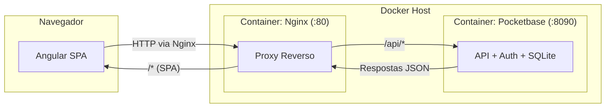

## 📄 Product Requirements Document (PRD) - Seção 8 Atualizada

# 📄 Product Requirements Document (PRD)

**Projeto:** Com Quem Será (Amigo Secreto)  
**Versão:** 1.0.0  
**Status:** 🟡 Em Definição (MVP)

## 🎯 1. Visão Geral e Objetivo
O "Com Quem Será" é um sistema de amigo secreto que resolve o problema de organizar sorteios de forma justa e anônima. O objetivo principal é permitir que um usuário autenticado crie um grupo, convide outros usuários, realize o sorteio aleatório e que cada participante descubra apenas a pessoa que deve presentear, sem saber quem o tirou. O projeto é focado no desenvolvimento frontend, utilizando Pocketbase como backend acadêmico com autenticação nativa.

## 📖 2. Glossário Ubíquo
- **Usuário:** Pessoa cadastrada no sistema com email e senha.
- **Grupo:** Espaço virtual que agrega um conjunto de participantes para um sorteio de amigo secreto.
- **Organizador:** Usuário que cria o grupo e possui permissões administrativas.
- **Participante:** Usuário convidado que faz parte de um grupo de amigo secreto (representado pelo registro em `group_participant`).
- **Sorteio:** Processo automático que preenche os campos `giver_id` e `receiver_id` na tabela `group_participant`, formando um ciclo fechado onde ninguém tira a si mesmo.
- **Revelação:** Momento em que o participante descobre qual é o seu "amigo secreto" (seu `receiver_id`).
- **Convite:** Link ou código único gerado para adicionar participantes a um grupo.

## 👤 3. Atores e Permissões
- **Organizador (Admin):**
  - Criar e deletar grupos.
  - Definir nome e descrição do grupo.
  - Iniciar o sorteio (apenas uma vez por grupo).
  - Remover participantes do grupo.
  - Visualizar todos os participantes e resultados (em modo debug/administrativo).
- **Participante Comum:**
  - Acessar o grupo via link de convite.
  - Visualizar apenas seu próprio amigo secreto (seu `receiver_id`) após o sorteio.
  - Sair do grupo (remover a si mesmo).

## 📝 4. Escopo Funcional (User Stories)
| ID | Como um... | Eu quero... | Para que... | Prioridade |
|----|------------|--------------|---------------|-------------|
| US01 | Usuário | Me cadastrar no sistema com email e senha | Ter uma identidade única no sistema | Must |
| US02 | Usuário | Fazer login no sistema | Acessar meus grupos e participar de sorteios | Must |
| US03 | Organizador | Criar um novo grupo de amigo secreto | Gerar um link de convite único | Must |
| US04 | Participante | Entrar em um grupo usando um link de convite | Fazer parte do sorteio | Must |
| US05 | Organizador | Iniciar o sorteio do grupo | Distribuir os amigos secretos aleatoriamente | Must |
| US06 | Participante | Visualizar meu amigo secreto (receiver_id) | Saber quem devo presentear | Must |
| US07 | Organizador | Remover um participante antes do sorteio | Gerenciar a lista de pessoas válidas | Could |
| US08 | Participante | Sair de um grupo antes do sorteio | Não participar mais da brincadeira | Should |
| US09 | Organizador | Ver todos os pares gerados no sorteio | Validar que ninguém tirou a si mesmo | Should |
| US10 | Usuário | Visualizar todos os grupos que participo | Ter uma visão geral das brincadeiras ativas | Must |

## 🛡️ 5. Regras de Negócio (Constraints)
- **RN01:** Um grupo deve ter no mínimo 3 participantes para que o sorteio seja realizado.
- **RN02:** O sorteio não pode ser realizado mais de uma vez no mesmo grupo (verificar se todos os `group_participant` já possuem `giver_id` e `receiver_id` preenchidos).
- **RN03:** Nenhum participante pode ser sorteado para presentear a si mesmo (impedir que `giver_id = receiver_id`).
- **RN04:** O resultado do sorteio (quem tirou quem) deve ser visível apenas para o organizador.
- **RN05:** O participante só pode ver seu `receiver_id` após o sorteio ser concluído.
- **RN06:** O link de convite deve expirar ou ser invalidado após o sorteio para evitar novas entradas.
- **RN07:** O organizador não pode ser removido do grupo.
- **RN08:** Um usuário só pode participar uma única vez do mesmo grupo (unicidade de `user_id + group_id` em `group_participant`).

## 🚫 6. Fora de Escopo (Non-goals)
- Envio automático de e-mails ou SMS com o resultado.
- Sistema de notificações push.
- Chat interno entre os participantes.
- Personalização de avatar ou foto de perfil.
- Suporte a múltiplos idiomas (apenas PT-BR).
- Integração com pagamentos ou validação de endereço.
- Recuperação de senha via email (MVP usa Pocketbase com email sem envio real).
- Sorteio com restrições personalizadas (ex: evitar pares específicos).

## ⚙️ 7. Requisitos Não Funcionais (Qualidade)
- **Responsividade:** Interface mobile-first, funcionando perfeitamente em celulares e tablets.
- **Performance:** O sorteio deve ser processado em menos de 2 segundos para grupos de até 50 participantes.
- **Usabilidade:** Fluxo claro e intuitivo, com feedbacks visuais e mensagens de erro amigáveis.
- **Manutenibilidade:** Código estruturado com componentes reutilizáveis e uso intensivo de RxJS para estado reativo.
- **Consistência:** UI consistente com o tema "amigo secreto" (cores suaves, tons de presente, celebração).
- **Segurança:** As regras de acesso do Pocketbase devem impedir que usuários vejam dados de outros.
- **Disponibilidade:** A aplicação deve estar disponível via containerização com Docker, permitindo fácil deploy em qualquer ambiente.
- **Portabilidade:** Todo o ambiente (frontend + backend + proxy) deve subir com um único comando (`docker-compose up`).

## 🛠️ 8. Tech Stack Principal (Diretrizes)

### 8.1. Frontend
| Categoria | Tecnologia | Versão | Finalidade |
| :--- | :--- | :--- | :--- |
| **Framework** | Angular | 19 (Standalone Components) | Estrutura principal da SPA |
| **Linguagem** | TypeScript | 5.x | Tipagem estática e manutenibilidade |
| **Estilização** | Tailwind CSS | 3.x | Utilitário CSS para UI responsiva |
| **Gerenciamento de Estado** | RxJS | 7.x | Reatividade e streams de dados |
| **Ícones** | Lucide Angular | ^0.x | Ícones vetoriais leves e customizáveis |
| **Build Tool** | Angular CLI | 19.x | Compilação, bundling e desenvolvimento |

### 8.2. Backend (BaaS Acadêmico)
| Categoria | Tecnologia | Versão | Finalidade |
| :--- | :--- | :--- | :--- |
| **Backend as a Service** | Pocketbase | ^0.22.x | API REST, autenticação nativa, banco SQLite |
| **SDK Cliente** | Pocketbase JS SDK | ^0.21.x | Comunicação frontend ↔ Pocketbase |
| **Banco de Dados** | SQLite (embutido) | 3.x | Persistência de dados (via Pocketbase) |

### 8.3. Infraestrutura e Deploy
| Categoria | Tecnologia | Versão | Finalidade |
| :--- | :--- | :--- | :--- |
| **Containerização** | Docker | 24.x+ | Empacotamento da aplicação |
| **Orquestração** | Docker Compose | 2.x+ | Multi-container (Nginx + Pocketbase) |
| **Servidor Web / Proxy** | Nginx | Alpine (latest) | Servir SPA e proxy reverso para API |
| **Rede Virtual** | Bridge Network (Docker) | - | Isolamento e comunicação entre containers |
| **Volumes Persistentes** | Bind mounts | - | Logs (`./server/`) e dados (`./db/`) |

### 8.4. Ambiente de Desenvolvimento
| Categoria | Tecnologia | Finalidade |
| :--- | :--- | :--- |
| **IDE** | Antigravity | Ambiente acadêmico de desenvolvimento |
| **Controle de Versão** | Git | Versionamento do código-fonte |
| **API Client** | Pocketbase Admin UI (via `/_/`) | Gerenciamento visual do banco e regras |

### 8.5. Comunicação Entre Camadas

### 8.6. Diretrizes Técnicas Obrigatórias
- **IDE:** Antigravity (ambientação acadêmica) - todo desenvolvimento deve ser feito nesta IDE.
- **Frontend:** Angular 19 com Standalone Components (módulos não são obrigatórios).
- **Backend:** Pocketbase será executado via Docker, não como binário local.
- **Estilização:** Tailwind CSS exclusivamente (sem CSS customizado ou pré-processadores).
- **Estado Global:** RxJS (BehaviorSubjects para estado reativo compartilhado).
- **Build:** Produção deve gerar artefatos estáticos otimizados via `ng build --configuration production`.
- **Deploy:** A aplicação completa (Angular + Nginx + Pocketbase) deve subir com `docker-compose up -d`.
- **Portas Expostas:** Apenas a porta 80 do Nginx deve estar acessível ao host.
- **Persistência:** Dados do Pocketbase (`pb_data`) e logs do Nginx (`server/logs`) devem persistir fora dos containers.

## 🖥️ 9. Descrição Funcional das Telas

> **Nota:** Esta seção descreve o comportamento e fluxo de cada tela, sem especificar cores, fontes ou posicionamento visual. O foco está na experiência do usuário e nas ações possíveis.

### 9.1. Tela de Login (`/login`)

**Acesso:** Rota pública. Usuários não autenticados são direcionados automaticamente para esta tela ao tentar acessar rotas protegidas. Usuários já autenticados que tentarem acessar esta rota são redirecionados para `/my-groups`.

**Comportamento esperado:**
- A tela apresenta um formulário com dois campos obrigatórios:
  - **Email** (formato válido de e-mail)
  - **Senha** (campo mascarado)
- Um botão principal **"Entrar"** submete o formulário.
- Um link ou botão secundário **"Criar conta"** redireciona para `/register`.
- Opcionalmente, um link **"Esqueci minha senha"** pode ser exibido (fora de escopo no MVP, mas pode ser desabilitado com mensagem informativa).

**Fluxos possíveis:**
| Cenário | Ação do Sistema |
| :--- | :--- |
| ✅ Credenciais válidas | Autentica o usuário via Pocketbase, armazena o token de sessão, redireciona para `/my-groups`. |
| ❌ Email não cadastrado | Exibe mensagem de erro: "Usuário não encontrado". |
| ❌ Senha incorreta | Exibe mensagem de erro: "Senha inválida". Limpa o campo senha mantendo o email preenchido. |
| ❌ Campos vazios | Desabilita o botão "Entrar" até que ambos os campos estejam preenchidos. Exibe validação em tempo real. |
| ❌ Email mal formatado | Exibe mensagem de erro: "Digite um email válido". |

**Feedback visual (semântico):**
- Durante o envio do formulário, o botão "Entrar" deve mostrar um estado de "carregando" (spinner ou texto "Entrando...") e ficar desabilitado para evitar múltiplos envios.
- Após erro, o campo correspondente deve ser destacado e receber foco automaticamente (quando aplicável).
- Em caso de erro de rede/ servidor, exibir mensagem genérica: "Erro de conexão. Tente novamente mais tarde."

**Transições:**
- Login bem-sucedido → `/my-groups`
- Clique em "Criar conta" → `/register`

---

### 9.2. Tela de Cadastro de Usuário (`/register`)

**Acesso:** Rota pública. Acessível via link da tela de login ou diretamente pela URL. Usuários já autenticados são redirecionados para `/my-groups`.

**Comportamento esperado:**
- A tela apresenta um formulário com os seguintes campos obrigatórios:
  - **Nome** (texto livre, mínimo 2 caracteres, máximo 100)
  - **Email** (formato válido, não pode existir outro usuário com o mesmo email)
  - **Senha** (mínimo 8 caracteres, campo mascarado)
  - **Confirmar senha** (deve ser idêntico ao campo senha)
- Um botão principal **"Cadastrar"** submete o formulário.
- Um link ou botão secundário **"Já tenho conta"** redireciona para `/login`.

**Regras de validação:**
| Campo | Regra | Mensagem de erro |
| :--- | :--- | :--- |
| Nome | Obrigatório, 2-100 caracteres | "Digite seu nome completo" |
| Email | Obrigatório, formato válido, único | "Email inválido" ou "Este email já está cadastrado" |
| Senha | Obrigatório, mínimo 8 caracteres | "A senha deve ter pelo menos 8 caracteres" |
| Confirmar Senha | Deve corresponder exatamente à Senha | "As senhas não coincidem" |

**Fluxos possíveis:**
| Cenário | Ação do Sistema |
| :--- | :--- |
| ✅ Dados válidos | Cria o usuário no Pocketbase, realiza login automático (ou redireciona para login com mensagem de sucesso), direciona para `/my-groups`. |
| ❌ Email já cadastrado | Exibe mensagem de erro no campo email: "Este email já está cadastrado". Mantém os demais campos preenchidos (exceto senhas). |
| ❌ Senhas não coincidem | Exibe mensagem de erro abaixo do campo "Confirmar senha". Limpa ambos os campos de senha. |
| ❌ Campos vazios ou inválidos | Desabilita o botão "Cadastrar" até que todos os campos estejam válidos. Exibe validação em tempo real (após o primeiro toque/ blur). |

**Feedback visual (semântico):**
- Durante o envio, o botão "Cadastrar" deve mostrar estado de "carregando" ("Cadastrando...") e ficar desabilitado.
- Validação em tempo real: campos inválidos são indicados imediatamente após o usuário sair do campo (evento blur).
- Após sucesso no cadastro, opcionalmente exibir um toast/mensagem: "Conta criada com sucesso! Bem-vindo(a) ao Com Quem Será".

**Transições:**
- Cadastro bem-sucedido → `/my-groups`
- Clique em "Já tenho conta" → `/login`

---

### 9.3. Tela Meus Grupos (`/my-groups`)

**Acesso:** Rota protegida por autenticação (`authGuard`). É a tela inicial após login bem-sucedido. Usuários não autenticados são redirecionados para `/login`.

**Layout Funcional:**
- A tela é dividida em duas áreas principais:
  1. **Cabeçalho:** Saudação ao usuário (ex: "Olá, [Nome]") e um botão "Criar novo grupo".
  2. **Área de conteúdo:** Lista paginada de cards, cada um representando um grupo do qual o usuário participa ou é organizador.

**Comportamento esperado:**

#### 9.3.1. Lista de Grupos (Paginada)
- Os grupos são carregados da API do Pocketbase, combinando:
  - Grupos onde o usuário é `created_by` (organizador)
  - Grupos onde o usuário possui um registro em `group_participant`
- A lista deve ser paginada com:
  - **Itens por página:** Configuração padrão (ex: 10 grupos por página)
  - **Controles de navegação:** Botões "Anterior", "Próximo" e indicador de página atual
  - **Total de registros:** Exibir "Mostrando X de Y grupos"
- Enquanto os dados são carregados, exibir um indicador de carregamento (spinner ou skeleton cards)
- Em caso de erro no carregamento, exibir mensagem amigável e botão "Tentar novamente"

#### 9.3.2. Card do Grupo (Estrutura)
Cada card deve conter as seguintes informações e ações:

| Elemento | Descrição | Origem dos Dados |
| :--- | :--- | :--- |
| **Nome do grupo** | Título principal do card | `group.name` |
| **Data de criação** | Exibir "Criado em dd/mm/aaaa" | `group.created_at` |
| **Data do sorteio** | Se `has_been_drawn = true`, exibir "Sorteio realizado em dd/mm/aaaa". Caso contrário, exibir "Sorteio não realizado" ou similar. | `group.has_been_drawn` e `draw.drawn_at` (se disponível) |
| **Número de participantes** | Exibir "X participantes" | `group.participants_count` ou cálculo via `group_participant` |
| **Indicador de administrador** | Se o usuário logado é o `created_by` do grupo, exibir um selo/ícone "Admin" ou "Organizador" | Comparar `group.created_by` com `currentUser.id` |
| **Botão de ação principal** | **"Acessar grupo"** → Redireciona para `/group/:groupId` | - |

**Comportamento do Card:**
- Ao clicar em qualquer área do card (exceto botões), redirecionar para o dashboard do grupo.
- O card inteiro deve ter um efeito de hover (feedback visual de que é clicável).
- Se o grupo já teve o sorteio realizado (`has_been_drawn = true`), o card pode ter um indicador visual diferente (ex: borda verde, ícone de presente).

#### 9.3.3. Estado "Nenhum grupo encontrado"
- Quando o usuário não participa de nenhum grupo e não criou nenhum grupo:
  - Exibir mensagem amigável: "Você ainda não participa de nenhum grupo de amigo secreto."
  - Exibir ilustração ou ícone temático (presente, envelope, etc.)
  - Destacar o botão "Criar novo grupo" (pode ser visualmente enfatizado)

#### 9.3.4. Botão "Criar novo grupo"
- Posicionado no cabeçalho da tela, sempre visível.
- Ao clicar, redireciona para `/create`.
- Deve ser acessível via teclado e leitores de tela.

**Fluxos possíveis:**
| Cenário | Ação do Sistema |
| :--- | :--- |
| ✅ Carregamento bem-sucedido | Exibe os cards dos grupos paginados. |
| ✅ Usuário clica em "Acessar grupo" | Redireciona para `/group/:groupId`. |
| ✅ Usuário clica em "Criar novo grupo" | Redireciona para `/create`. |
| ✅ Usuário navega entre páginas | Recarrega a lista com os grupos da página solicitada. Mantém o estado de scroll (opcional). |
| ❌ Sessão expirada durante uso | Redireciona para `/login` com mensagem "Sua sessão expirou. Faça login novamente." |
| ❌ Erro de rede ao carregar grupos | Exibe mensagem de erro e botão "Tentar novamente". |

**Feedback visual (semântico):**
- **Carregamento inicial:** Spinner centralizado ou skeleton cards (recomendado para melhor experiência).
- **Mudança de página:** Desabilitar controles de paginação durante o carregamento, exibir spinner pequeno ou skeleton nos cards.
- **Sem grupos:** Mensagem centralizada com botão de criação destacado.
- **Card com admin:** Selo/ícone discreto mas perceptível (ex: "Admin" ou estrela/escudo).

**Paginação (Detalhes Técnicos Comportamentais):**
- A paginação deve ser baseada em **offset/limit** ou **cursor** (conforme suporte do Pocketbase).
- Parâmetros de consulta na URL (opcional, mas recomendado para compartilhamento):
  - `?page=1&limit=10`
- Ao navegar para outra página, a URL deve ser atualizada para permitir voltar/avançar no histórico do navegador.
- O número total de páginas é calculado com base no total de grupos ÷ limite por página.

**Transições:**
- Clique em "Criar novo grupo" → `/create`
- Clique em "Acessar grupo" → `/group/:groupId`
- Sessão expirada → `/login`
- Logout (ação do usuário, via botão de sair) → `/login`

---
