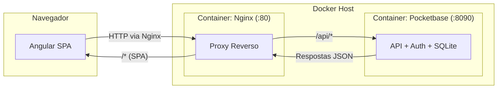

## 📄 Product Requirements Document (PRD) - Seção 8 Atualizada

# 📄 Product Requirements Document (PRD)

**Projeto:** Com Quem Será (Amigo Secreto)  
**Versão:** 1.0.0  
**Status:** 🟡 Em Definição (MVP)

## 🎯 1. Visão Geral e Objetivo
O "Com Quem Será" é um sistema de amigo secreto que resolve o problema de organizar sorteios de forma justa e anônima. O objetivo principal é permitir que um usuário autenticado crie um grupo, convide outros usuários, realize o sorteio aleatório e que cada participante descubra apenas a pessoa que deve presentear, sem saber quem o tirou. O projeto é focado no desenvolvimento frontend, utilizando Pocketbase como backend acadêmico com autenticação nativa.

## 📖 2. Glossário Ubíquo
- **Usuário:** Pessoa cadastrada no sistema com email e senha.
- **Grupo:** Espaço virtual que agrega um conjunto de participantes para um sorteio de amigo secreto.
- **Organizador:** Usuário que cria o grupo e possui permissões administrativas.
- **Participante:** Usuário convidado que faz parte de um grupo de amigo secreto (representado pelo registro em `group_participant`).
- **Sorteio:** Processo automático que preenche os campos `giver_id` e `receiver_id` na tabela `group_participant`, formando um ciclo fechado onde ninguém tira a si mesmo.
- **Revelação:** Momento em que o participante descobre qual é o seu "amigo secreto" (seu `receiver_id`).
- **Convite:** Link ou código único gerado para adicionar participantes a um grupo.

## 👤 3. Atores e Permissões
- **Organizador (Admin):**
  - Criar e deletar grupos.
  - Definir nome e descrição do grupo.
  - Iniciar o sorteio (apenas uma vez por grupo).
  - Remover participantes do grupo.
  - Visualizar todos os participantes e resultados (em modo debug/administrativo).
- **Participante Comum:**
  - Acessar o grupo via link de convite.
  - Visualizar apenas seu próprio amigo secreto (seu `receiver_id`) após o sorteio.
  - Sair do grupo (remover a si mesmo).

## 📝 4. Escopo Funcional (User Stories)
| ID | Como um... | Eu quero... | Para que... | Prioridade |
|----|------------|--------------|---------------|-------------|
| US01 | Usuário | Me cadastrar no sistema com email e senha | Ter uma identidade única no sistema | Must |
| US02 | Usuário | Fazer login no sistema | Acessar meus grupos e participar de sorteios | Must |
| US03 | Organizador | Criar um novo grupo de amigo secreto | Gerar um link de convite único | Must |
| US04 | Participante | Entrar em um grupo usando um link de convite | Fazer parte do sorteio | Must |
| US05 | Organizador | Iniciar o sorteio do grupo | Distribuir os amigos secretos aleatoriamente | Must |
| US06 | Participante | Visualizar meu amigo secreto (receiver_id) | Saber quem devo presentear | Must |
| US07 | Organizador | Remover um participante antes do sorteio | Gerenciar a lista de pessoas válidas | Could |
| US08 | Participante | Sair de um grupo antes do sorteio | Não participar mais da brincadeira | Should |
| US09 | Organizador | Ver todos os pares gerados no sorteio | Validar que ninguém tirou a si mesmo | Should |
| US10 | Usuário | Visualizar todos os grupos que participo | Ter uma visão geral das brincadeiras ativas | Must |

## 🛡️ 5. Regras de Negócio (Constraints)
- **RN01:** Um grupo deve ter no mínimo 3 participantes para que o sorteio seja realizado.
- **RN02:** O sorteio não pode ser realizado mais de uma vez no mesmo grupo (verificar se todos os `group_participant` já possuem `giver_id` e `receiver_id` preenchidos).
- **RN03:** Nenhum participante pode ser sorteado para presentear a si mesmo (impedir que `giver_id = receiver_id`).
- **RN04:** O resultado do sorteio (quem tirou quem) deve ser visível apenas para o organizador.
- **RN05:** O participante só pode ver seu `receiver_id` após o sorteio ser concluído.
- **RN06:** O link de convite deve expirar ou ser invalidado após o sorteio para evitar novas entradas.
- **RN07:** O organizador não pode ser removido do grupo.
- **RN08:** Um usuário só pode participar uma única vez do mesmo grupo (unicidade de `user_id + group_id` em `group_participant`).

## 🚫 6. Fora de Escopo (Non-goals)
- Envio automático de e-mails ou SMS com o resultado.
- Sistema de notificações push.
- Chat interno entre os participantes.
- Personalização de avatar ou foto de perfil.
- Suporte a múltiplos idiomas (apenas PT-BR).
- Integração com pagamentos ou validação de endereço.
- Recuperação de senha via email (MVP usa Pocketbase com email sem envio real).
- Sorteio com restrições personalizadas (ex: evitar pares específicos).

## ⚙️ 7. Requisitos Não Funcionais (Qualidade)
- **Responsividade:** Interface mobile-first, funcionando perfeitamente em celulares e tablets.
- **Performance:** O sorteio deve ser processado em menos de 2 segundos para grupos de até 50 participantes.
- **Usabilidade:** Fluxo claro e intuitivo, com feedbacks visuais e mensagens de erro amigáveis.
- **Manutenibilidade:** Código estruturado com componentes reutilizáveis e uso intensivo de RxJS para estado reativo.
- **Consistência:** UI consistente com o tema "amigo secreto" (cores suaves, tons de presente, celebração).
- **Segurança:** As regras de acesso do Pocketbase devem impedir que usuários vejam dados de outros.
- **Disponibilidade:** A aplicação deve estar disponível via containerização com Docker, permitindo fácil deploy em qualquer ambiente.
- **Portabilidade:** Todo o ambiente (frontend + backend + proxy) deve subir com um único comando (`docker-compose up`).

## 🛠️ 8. Tech Stack Principal (Diretrizes)

### 8.1. Frontend
| Categoria | Tecnologia | Versão | Finalidade |
| :--- | :--- | :--- | :--- |
| **Framework** | Angular | 19 (Standalone Components) | Estrutura principal da SPA |
| **Linguagem** | TypeScript | 5.x | Tipagem estática e manutenibilidade |
| **Estilização** | Tailwind CSS | 3.x | Utilitário CSS para UI responsiva |
| **Gerenciamento de Estado** | RxJS | 7.x | Reatividade e streams de dados |
| **Ícones** | Lucide Angular | ^0.x | Ícones vetoriais leves e customizáveis |
| **Build Tool** | Angular CLI | 19.x | Compilação, bundling e desenvolvimento |

### 8.2. Backend (BaaS Acadêmico)
| Categoria | Tecnologia | Versão | Finalidade |
| :--- | :--- | :--- | :--- |
| **Backend as a Service** | Pocketbase | ^0.22.x | API REST, autenticação nativa, banco SQLite |
| **SDK Cliente** | Pocketbase JS SDK | ^0.21.x | Comunicação frontend ↔ Pocketbase |
| **Banco de Dados** | SQLite (embutido) | 3.x | Persistência de dados (via Pocketbase) |

### 8.3. Infraestrutura e Deploy
| Categoria | Tecnologia | Versão | Finalidade |
| :--- | :--- | :--- | :--- |
| **Containerização** | Docker | 24.x+ | Empacotamento da aplicação |
| **Orquestração** | Docker Compose | 2.x+ | Multi-container (Nginx + Pocketbase) |
| **Servidor Web / Proxy** | Nginx | Alpine (latest) | Servir SPA e proxy reverso para API |
| **Rede Virtual** | Bridge Network (Docker) | - | Isolamento e comunicação entre containers |
| **Volumes Persistentes** | Bind mounts | - | Logs (`./server/`) e dados (`./db/`) |

### 8.4. Ambiente de Desenvolvimento
| Categoria | Tecnologia | Finalidade |
| :--- | :--- | :--- |
| **IDE** | Antigravity | Ambiente acadêmico de desenvolvimento |
| **Controle de Versão** | Git | Versionamento do código-fonte |
| **API Client** | Pocketbase Admin UI (via `/_/`) | Gerenciamento visual do banco e regras |

### 8.5. Comunicação Entre Camadas

### 8.6. Diretrizes Técnicas Obrigatórias
- **IDE:** Antigravity (ambientação acadêmica) - todo desenvolvimento deve ser feito nesta IDE.
- **Frontend:** Angular 19 com Standalone Components (módulos não são obrigatórios).
- **Backend:** Pocketbase será executado via Docker, não como binário local.
- **Estilização:** Tailwind CSS exclusivamente (sem CSS customizado ou pré-processadores).
- **Estado Global:** RxJS (BehaviorSubjects para estado reativo compartilhado).
- **Build:** Produção deve gerar artefatos estáticos otimizados via `ng build --configuration production`.
- **Deploy:** A aplicação completa (Angular + Nginx + Pocketbase) deve subir com `docker-compose up -d`.
- **Portas Expostas:** Apenas a porta 80 do Nginx deve estar acessível ao host.
- **Persistência:** Dados do Pocketbase (`pb_data`) e logs do Nginx (`server/logs`) devem persistir fora dos containers.
