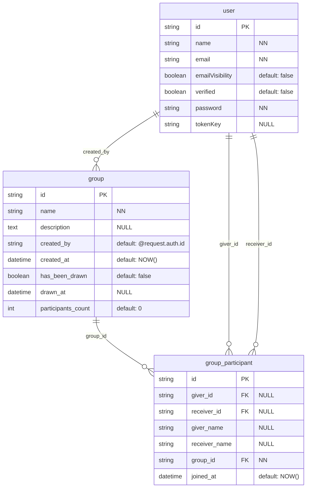
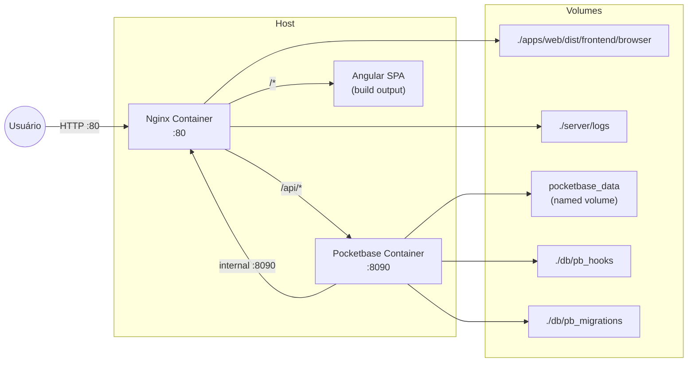

## 🛠️ Software Design Document (SDD) - Seção de Infraestrutura Adicionada

# 🛠️ Software Design Document (SDD)

**Projeto:** Com Quem Será (Amigo Secreto)
**Versão:** 1.0.0  
**Status:** 🟡 Em Desenvolvimento (Implementando Infraestrutura).

## 🤖 1. Orquestração e Contexto de IA (MCP)
> Configuração dos servidores Model Context Protocol para a IDE Agêntica.

* **Figma/Stitch MCP:** `N/A - Projeto sem design prévio no Figma (será feito diretamente com Tailwind).`
* **Pocketbase MCP:** Contexto do banco de dados local ou pocketbase.io (coleções: `users`, `group`, `group_participant`).
* **GitHub MCP:** Leitura das Issues do Kanban para orientar a implementação (Spec-Driven).

## 📦 2. Stack Tecnológica e Bibliotecas
> Definição estrita das tecnologias permitidas (package.json). Nenhuma dependência externa deve ser instalada sem refletir aqui.

* **Core:** Angular 19 (Standalone / Signals).
* **BaaS & Auth:** Pocketbase SDK (`npm install pocketbase`).
* **Estilização & UI:** Tailwind CSS (com plugin forms), Lucide Angular (Ícones).
* **Regra de Estilização:** Todo componente deve usar **exclusivamente** classes utilitárias Tailwind no template HTML. **Nenhum componente pode possuir arquivo CSS próprio** (`styleUrl` / `styleUrls`). Estilos globais e customizações devem ser centralizados em `src/styles.css`.
* **Utilitários:** RxJS (já incluso no Angular), `date-fns` (para manipulação de datas, opcional).
* **HTTP:** Pocketbase SDK (wrapper sobre fetch).
* **Infraestrutura:** Docker, Docker Compose, Nginx (servidor web e proxy reverso).

## 🗄️ 3. Arquitetura de Dados

### 📖 3.1. Glossário Técnico (Mapeamento)
| Termo PRD (PT-BR) | Entidade Técnica (EN) | Atributos Principais |
| :--- | :--- | :--- |
| Usuário | `user` (coleção nativa Pocketbase) | `id`, `name`, `email`, `verified`, `emailVisibility` |
| Grupo | `group` | `id`, `name`, `description`, `created_by` (FK user.id), `created_at`, `has_been_drawn`, `drawn_at`, `participants_count` |
| Participante | `group_participant` | `id`, `group_id` (FK), `giver_id` (FK user.id, NULL antes sorteio), `receiver_id` (FK user.id, NULL antes sorteio), `joined_at` |
| Sorteio (implícito) | Atualização em massa dos `giver_id` e `receiver_id` na tabela `group_participant` | - |

### 📊 3.2. Diagrama ER (Mermaid)



## 📑 4. Contratos Globais (Interfaces & Types)
> Tipagem TypeScript baseada no banco de dados Pocketbase.

```typescript
// src/app/core/models/user.model.ts
export interface User {
  id: string;
  name: string;
  email: string;
  emailVisibility: boolean;
  verified: boolean;
  created: string;   // ISO date
  updated: string;   // ISO date
}

// DTO para criação/edição de usuário (registro)
export interface CreateUserDTO {
  name: string;
  email: string;
  emailVisibility?: boolean;
  password: string;
  passwordConfirm: string;
}

// DTO para login
export interface LoginDTO {
  email: string;
  password: string;
}

// src/app/core/models/group.model.ts
export interface Group {
  id: string;
  name: string;
  description?: string;
  created_by: string;   // user.id
  created_at: string;   // ISO date
  has_been_drawn: boolean;
  drawn_at?: string;    // ISO date
  participants_count: number;
  expand?: {
    created_by?: User;
    participants_via_group_id?: GroupParticipant[];
  };
}

export type CreateGroupDTO = Omit<Group, 'id' | 'created_at' | 'has_been_drawn' | 'drawn_at'>;

// src/app/core/models/group-participant.model.ts
export interface GroupParticipant {
  id: string;
  giver_id: string | null;      // quem presenteia (preenchido após sorteio)
  giver_name: string;           // denormalized name do giver
  receiver_id: string | null;   // quem recebe (preenchido após sorteio)
  receiver_name: string | null; // denormalized name do receiver
  group_id: string;
  joined_at: string;            // ISO date
  expand?: {
    giver_id?: User;
    receiver_id?: User;
    group_id?: Group;
  };
}

export type JoinGroupDTO = Omit<GroupParticipant, 'id' | 'joined_at'>;

// DTO para atualização de perfil
export interface UpdateProfileDTO {
  name?: string;
  password?: string;
  passwordConfirm?: string;
  oldPassword?: string; // Necessário para troca de senha no Pocketbase
}

// Estado global da aplicação (gerenciado com RxJS)
export interface AppState {
  currentUser: User | null;
  currentGroup: Group | null;
  currentParticipant: GroupParticipant | null;
  groupParticipants: GroupParticipant[];
  isLoading: boolean;
  error: string | null;
}
```

## 🏗️ 5. Scaffolding Macro (Arquitetura Frontend)

### 📂 5.1. Estrutura de Pastas (Monorepo)
```
projeto/
├── apps/
│   ├── web/                     # Aplicação Angular (antigo frontend/)
│   │   ├── src/
│   │   │   ├── app/
│   │   │   │   ├── core/
│   │   │   │   ├── features/
│   │   │   │   └── shared/
│   │   ├── Dockerfile
│   │   ├── nginx.conf
│   │   └── angular.json
│   └── api/                     # Futura API / Backend
├── server/                     # Volumes do Nginx (logs e configuração)
│   ├── logs/
│   └── conf.d/
├── db/                         # Volumes do Pocketbase (dados, logs, uploads)
│   ├── pb_data/
│   ├── pb_public/
│   ├── pb_hooks/
│   └── pb_migrations/
├── package.json                # Maestro do Monorepo (NPM Workspaces)
├── docker-compose.yml
└── .env
```

### 🚦 5.2. Mapa de Rotas e Páginas (Features)
| Rota | Page Component | Functional Guard |
| :--- | :--- | :--- |
| `/` | Redireciona para `/my-groups` | `authGuard` |
| `/login` | `features/auth/login/login.page.ts` | Público (redireciona se logado) |
| `/register` | `features/auth/register/register.page.ts` | Público |
| `/my-groups` | `features/my-groups/my-groups.page.ts` | `authGuard` |
| `/create` | `features/create-group/create-group.page.ts` | `authGuard` |
| `/join` | `features/join-group/join-group.page.ts` (query param `?code=xxx`) | `authGuard` |
| `/group/:groupId` | `features/group-dashboard/group-dashboard.page.ts` | `authGuard`, `groupExistsGuard` |
| `/group/:groupId/admin` | `features/admin/admin-dashboard.page.ts` | `authGuard`, `groupExistsGuard`, `isOrganizerGuard` |
| `/profile` | `features/profile/profile.page.ts` (placeholder) | `authGuard` |

### 🧠 5.3. Core Services (Singleton)
| Service | Arquivo | Responsabilidade Macro |
| :--- | :--- | :--- |
| `AuthService` | `core/services/auth.service.ts` | Gerenciar sessão Pocketbase, login, logout, registro, editar perfil (nome/senha), expor `currentUser$` (BehaviorSubject). |
| `GroupService` | `core/services/group.service.ts` | CRUD de grupos, buscar grupo por ID, listar grupos do usuário (via `group_participant`), estado do grupo atual. |
| `ParticipantService` | `core/services/participant.service.ts` | CRUD em `group_participant`: entrar no grupo (`giver_id`/`receiver_id` = null), sair do grupo, listar participantes de um grupo. |
| `DrawService` | `core/services/draw.service.ts` | Lógica do sorteio: algoritmo de Fisher-Yates que gera um ciclo válido (sem auto-sorteio) e atualiza em lote os `giver_id`/`receiver_id`. Verifica se o sorteio já foi realizado. |
| `StateService` | `core/services/state.service.ts` | Gerenciamento global de estado reativo (grupo atual, participantes, loading, erros) usando RxJS Subjects e combinação com os outros services. |

## 🛡️ 6. Segurança (Pocketbase Collection Rules)
> Regras de acesso configuradas diretamente no Pocketbase via UI ou API.

| Coleção | Regra de Acesso (Pocketbase Rule) | Explicação |
| :--- | :--- | :--- |
| `users` | `@request.auth.id = id` (para update/delete/view detalhado) <br> `@request.auth.id != ""` (para listagem básica) | Usuários só podem ver/editar seus próprios dados. |
| `group` | `create`: `@request.auth.id != ""` <br> `view`: `@request.auth.id != ""` <br> `update/delete`: `created_by = @request.auth.id` | Qualquer usuário logado pode criar/ver grupos. Apenas o criador pode editar/deletar. |
| `group_participant` | `create`: `@request.auth.id != ""` e o grupo não pode ter `has_been_drawn = true` <br> `view`: `@request.auth.id = giver_id OR @request.auth.id = receiver_id OR group_id.created_by = @request.auth.id` <br> `update`: apenas o sistema (via sorteio) ou organizador para remover participantes (antes do sorteio) <br> `delete`: apenas o próprio participante ou organizador (antes do sorteio) | Participantes veem apenas seus próprios pares ou organizador vê tudo. Sorteio é executado por código backend confiável (ou API com regra especial). |

### Regra adicional para o sorteio (API custom ou endpoint):
- O organizador deve executar o sorteio via um **endpoint de API customizado** no Pocketbase (ou uma função que verifica permissões) que:
  1. Verifica se o usuário logado é o `created_by` do grupo.
  2. Verifica se o grupo ainda não foi sorteado (`has_been_drawn = false`).
  3. Verifica se o grupo tem pelo menos 3 participantes.
  4. Executa o algoritmo de sorteio.
  5. Atualiza em lote todos os `group_participant` com seus respectivos `giver_id`/`receiver_id`.
  6. Marca `group.has_been_drawn = true`.
  7. Retorna sucesso ou erro.

## 📐 5.4. Diretrizes de Criação e Edição de Building Blocks

Todo novo building block (componente, service, página, diretiva, pipe) deve:

- **Sempre ser acompanhado de testes** — nenhum building block é considerado completo sem ao menos um `spec` cobrindo seu comportamento essencial.
- **Preferir testes antes da implementação** — a especificação dos testes (red/green) deve guiar o desenvolvimento, garantindo que o código entregue apenas o que é necessário para satisfazer os critérios de aceitação.
- **Ser gerado pelo Angular CLI sempre que possível** — `ng generate component`, `ng generate service` etc. produzem automaticamente o arquivo `.spec.ts` correspondente, além de registrar corretamente os metadados. O uso do CLI é recomendado antes de detalhar manualmente a implementação, reduzindo erro humano e padronizando a estrutura.
- **Execução de testes via Docker:** Todos os testes devem ser executados com `npm run docker:test`, que sobe os containers Pocketbase + Selenium, executa os specs e encerra tudo automaticamente.
- **Filtragem de testes específicos:** Filtragem via linha de comando **não está disponível no momento**. Use `fdescribe()`/`fit()`.

### Componentes Compartilhados (Shared)

| Componente | Descrição | Inputs |
|---|---|---|
| `BottomNavComponent` | Barra de navegação inferior fixa com ícones Lucide e `routerLinkActive` | `items: NavItem[]` (label, icon, route) |
| `GroupCardComponent` | Card de grupo com badge de status (ATIVO/PENDENTE/SORTEADO), Admin badge, contagem de participantes | `group: Group`, `isAdmin: boolean` |

### Novos Componentes (Stitch-aligned)

- **ProfileComponent** (`/profile`): Placeholder com info do usuário e logout. Bottom nav integrado.
- **BottomNavComponent**: 3 itens (Grupos/Criar/Perfil), ativo detectado via `routerLinkActive`.
- **GroupCardComponent status badges**: 3 estados — SORTEADO (`has_been_drawn`), ATIVO (>= 3 participantes), PENDENTE (< 3 participantes).

### Status Card Badges (GroupCardComponent)

| Badge | Condição | Cor |
|---|---|---|
| SORTEADO | `has_been_drawn === true` | Secondary (verde) |
| ATIVO | `!has_been_drawn && participants_count >= 3` | Primary (vermelho) |
| PENDENTE | `!has_been_drawn && participants_count < 3` | Neutral (cinza) |

---

## 🐳 7. Infraestrutura e Deploy

### 📦 7.1. Arquitetura de Containers



### 📄 7.3. Nginx Configuration (server/nginx.conf)

```nginx
server {
    listen 80;
    server_name localhost;
    root /usr/share/nginx/html;
    index index.html;

    # Gzip compression
    gzip on;
    gzip_types text/plain text/css application/json application/javascript text/xml application/xml application/xml+rss text/javascript;

    # Proxy para API do Pocketbase
    location /api/ {
        proxy_pass http://pocketbase:8090/api/;
        proxy_http_version 1.1;
        proxy_set_header Upgrade $http_upgrade;
        proxy_set_header Connection 'upgrade';
        proxy_set_header Host $host;
        proxy_set_header X-Real-IP $remote_addr;
        proxy_set_header X-Forwarded-For $proxy_add_x_forwarded_for;
        proxy_set_header X-Forwarded-Proto $scheme;
        proxy_cache_bypass $http_upgrade;
        
        # Timeouts para operações longas (sorteio)
        proxy_connect_timeout 60s;
        proxy_send_timeout 60s;
        proxy_read_timeout 60s;
    }

    # Proxy para admin UI do Pocketbase (opcional, apenas desenvolvimento)
    location /_/ {
        proxy_pass http://pocketbase:8090/_/;
        proxy_http_version 1.1;
        proxy_set_header Host $host;
        proxy_set_header X-Real-IP $remote_addr;
    }

    # Arquivos estáticos com cache
    location ~* \.(js|css|png|jpg|jpeg|gif|ico|svg|woff|woff2)$ {
        expires 1y;
        add_header Cache-Control "public, immutable";
    }

    # SPA fallback (todas as rotas não API vão para index.html)
    location / {
        try_files $uri $uri/ /index.html;
    }

    # Logs
    access_log /var/log/nginx/access.log;
    error_log /var/log/nginx/error.log;
}
```

### 🏗️ 7.4. Frontend Dockerfile (apps/web/Dockerfile - Multi-stage)

```dockerfile
FROM node:lts-alpine AS builder

USER node

WORKDIR /app

COPY --chown=node:node ../.. .

ENV APP_ENV=prod
CMD sh -c "npm install && if [ \"$APP_ENV\" = \"dev\" ]; then npm run dev:web:watch; else npm run dev:web:build; fi"

FROM builder AS test

USER root
RUN apk add --no-cache curl
USER node

ENV APP_ENV=dev
ENV KARMA_BROWSER=SeleniumFirefox
ENV SELENIUM_HOST=selenium-firefox
ENV SELENIUM_PORT=4444
ENV KARMA_HOSTNAME=test
CMD npm install && \
  echo 'Aguardando selenium-firefox ficar pronto...' && \
  for i in $(seq 1 30); do \
    curl -s http://selenium-firefox:4444/wd/hub/status > /dev/null 2>&1 && \
    echo 'Selenium pronto!' && break; \
    echo "Tentativa $i/30..."; sleep 2; \
  done && \
  npm run dev:web:test -- --browsers=SeleniumFirefox --no-watch --source-map=false
```

O Dockerfile possui dois targets:
- **`builder`**: usado pelos profiles `dev` e `prod`. Compila o Angular SPA.
- **`test`**: estende `builder` e adiciona curl (para healthcheck do Selenium). Executa os testes com Karma + Selenium Firefox.

### 📁 7.5. Estrutura de Arquivos de Infraestrutura

```
projeto/
├── .env                        # Variáveis de ambiente
├── docker-compose.yml
├── package.json                # Workspaces config
├── apps/
│   ├── web/
│   │   ├── Dockerfile
│   │   ├── nginx.conf
│   │   └── ... (código Angular)
│   └── api/
├── server/                     # Persistentes do Nginx
│   ├── logs/
│   └── nginx.conf
└── db/                         # Persistentes do Pocketbase
    ├── pb_data/
    ├── pb_public/
    ├── pb_hooks/
    └── pb_migrations/
```

### 🔧 7.6. Comandos de Operação

| Comando | Descrição |
| :--- | :--- |
| `docker compose up -d` | Iniciar todos os containers em background |
| `docker compose down` | Parar e remover containers |
| `docker compose logs -f nginx` | Ver logs do Nginx em tempo real |
| `docker compose logs -f pocketbase` | Ver logs do Pocketbase em tempo real |
| `docker compose exec pocketbase ls -la /pb/pb_data` | Inspecionar volume de dados |
| `docker compose restart nginx` | Reiniciar apenas o Nginx |
| `npm run docker:test` | Executar testes Karma via Selenium Firefox em Docker |
| `docker compose --profile test up --abort-on-container-exit --exit-code-from test` | (equivalente ao script acima) |
| `npm run docker:test '**/*nome*'` | ~~Executar apenas testes que correspondem ao padrão glob~~ **Indisponível** — use `fdescribe()`/`fit()` no spec |

### 🌐 7.7. URLs de Acesso

| Serviço | URL (Host) | Container Interno | Acessível ao Host? |
| :--- | :--- | :--- | :--- |
| Aplicação Angular | `http://localhost` | Nginx :80 | ✅ Sim |
| API Pocketbase | `http://localhost/api/*` | Pocketbase :8090 | ✅ Sim (via proxy) |
| Admin UI Pocketbase | `http://localhost/_/` | Pocketbase :8090 | ✅ Sim (via proxy, opcional) |
| Pocketbase Direto | `http://localhost:8090` | - | ❌ Não (porta não exposta) |

### 🔒 7.8. Segurança da Infraestrutura

- **Isolamento de Rede:** Containers se comunicam apenas via rede interna `amigo-secreto-network`.
- **Portas Expostas:** Apenas a porta 80 do Nginx está acessível ao host.
- **Volumes Persistentes:** Dados do Pocketbase (`pb_data`) persistem mesmo após `docker-compose down`.
- **Logs Rotativos:** Configurar logrotate no host para `./server/logs/*.log` (opcional).
- **Variáveis Sensíveis:** Usar arquivo `.env` (não versionado) para credenciais do superuser do Pocketbase.

### 📦 7.9. Build e Deploy (Pipeline Manual)

```bash
# 1. Configurar variáveis de ambiente
cp example.env .env

# 2. Build da aplicação Angular (via Workspace)
npm run build -w apps/web -- --configuration production

# 3. (Opcional) Copiar configuração custom do Nginx
cp apps/web/nginx.conf server/nginx.conf

# 4. Subir os containers
docker-compose up -d --build

# 5. Verificar status
docker-compose ps

# 6. Acompanhar logs iniciais
```

### 🧪 7.10. Infraestrutura de Testes

Os testes unitários e de integração dos componentes Angular rodam dentro de um container Docker via **Karma** com **Selenium Grid (Firefox)**, utilizando o **esbuild bundler** do Angular 19.

#### Arquitetura do Test Runner

```
test container (Karma :9876) ←── selenium-firefox container (WebDriver :4444)
         │                             │
         └── amigo-secreto-network ────┘
```

- Karma escuta em `test:9876` (hostname definido via `KARMA_HOSTNAME=test`).
- Selenium Firefox conecta-se ao Karma via WebDriver e executa os specs no browser.
- O container `test` depende de `selenium-firefox` e `pocketbase` (start顺序).

#### Configuração do Karma (`apps/web/karma.conf.js`)

```javascript
const browser = process.env['KARMA_BROWSER'] || 'FirefoxHeadless';
const karmaHostname = process.env['KARMA_HOSTNAME'] || 'localhost';

// Selenium WebDriver launcher (usado em CI/Docker)
if (browser === 'SeleniumFirefox') {
  customLaunchers.SeleniumFirefox = {
    base: 'WebDriver',
    config: {
      hostname: process.env['SELENIUM_HOST'],
      port: Number(process.env['SELENIUM_PORT']),
      path: '/wd/hub',
    },
    browserName: 'firefox',
    'wd-no-defaults': true,
    forceW3C: true,           // necessário para Selenium Grid moderno
  };
}

module.exports = function (config) {
  config.set({
    frameworks: ['jasmine'],
    plugins: [/* karma-jasmine, karma-spec-reporter, karma-webdriver-launcher */],
    reporters: ['spec'],        // saída clara por teste (pass/fail)
    browsers: [browser],
    customLaunchers,
    hostname: karmaHostname,
    singleRun: true,            // encerra após execução completa
  });
};
```

#### Configuração do Angular (`angular.json` - test section)

```jsonc
"test": {
  "builder": "@angular-devkit/build-angular:karma",
  "options": {
    "builderMode": "detect",    // força o uso do esbuild builder path
    "watch": false,             // sem watch mode em CI
    "polyfills": [
      "zone.js",
      "zone.js/testing",
      "src/disable-zonejs-trace.ts"   // suprime long stack traces do zone.js
    ],
    "include": ["src/**/*.spec.ts"],  // descoberta de spec files
    "tsConfig": "tsconfig.spec.json"
  }
}
```

#### Entrypoint de Teste (`apps/web/src/test.ts`)

```typescript
import 'zone.js';
import 'zone.js/testing';
import { getTestBed } from '@angular/core/testing';
import {
  BrowserDynamicTestingModule,
  platformBrowserDynamicTesting,
} from '@angular/platform-browser-dynamic/testing';

getTestBed().initTestEnvironment(
  BrowserDynamicTestingModule,
  platformBrowserDynamicTesting()
);
```

#### Volume Mounts

Os containers `build` e `test` **não** utilizam volume bind da raiz do projeto (`.:/app`). O código-fonte é copiado para a imagem via `COPY` no Dockerfile. O `node_modules` é criado na camada writável do container durante o `npm install` no CMD, evitando conflitos de permissão (UID do host vs. UID do container).

Volumes específicos (ex: `pocketbase_data`, `./db/pb_migrations`) são montados apenas onde necessário.

#### Padrão para Spec Files

- **Preferir integração real ao PocketBase para fluxos padrão da aplicação:** Testes que cobrem comportamentos esperados (success cases, sem erros classe 500) **não devem mockar** `GroupService`, `ParticipantService`, `AuthService` nem o `PocketBaseClient`. Em vez disso, devem utilizar o endpoint `/api/test/reseed` para resetar os dados e realizar login real com os usuários de teste (`ana@exemplo.com`, `beto@exemplo.com`, `caio@exemplo.com`). Isso garante que o teste valide a integração completa entre frontend e backend, detectando problemas de regras de acesso, contratos de dados e comportamento real dos serviços.
- **Mock apenas para cenários de erro:** Mocks são permitidos exclusivamente para simular falhas que o backend real não produz naturalmente (ex: erro de rede, timeout, resposta 500). Nesses casos, as dependências que interagem com o PocketBase (`GroupService`, `AuthService`, etc.) podem ser substituídas por mocks Jasmine.
- Specs usam `new InMemoryAuthStore()` em vez de `TestBed.inject(InMemoryAuthStore)` para evitar erro "Cannot configure test module".
- Componentes com `<router-outlet>` ou `RouterLink` devem prover roteamento via `provideRouter(routes)` no `TestBed.configureTestingModule`.
- Testes de navegação assíncrona usam `fakeAsync` + `tick()` com `TestBed.inject(Router)` para forçar a inicialização do roteador.

## 🧪 7.11. Endpoint de Teste

Para garantir a consistência dos testes de integração, o PocketBase expõe um endpoint que **limpa e recarrega os dados de teste (reseed)**, **disponível apenas quando `APP_ENV=dev`**.

### Rota

| Método | Rota | Condição |
|--------|------|----------|
| `GET` | `/api/test/reseed` | `APP_ENV=dev` |

### Comportamento

1. Remove **todos** os registros das coleções `group_participants`, `groups`, `users`
2. Recria os seguintes dados de teste do zero:

| Tabela | Registros |
|--------|-----------|
| `users` | `ana@exemplo.com`, `beto@exemplo.com`, `caio@exemplo.com` (senha: `1234567890`, todos `verified: true`) |
| `groups` | 1 grupo "Amigo Secreto 2024" criado por `ana@exemplo.com` |
| `group_participants` | 3 registros associando cada user ao grupo |

> ⚠️ **Importante:** O nome `reseed` reflete que o endpoint **não apenas limpa**, mas também **recarrega** os dados de teste. Esse é o único propósito do endpoint — restaurar o estado inicial conhecido para os testes de integração.

### Definição

O endpoint é registrado via hook em `db/pb_hooks/seed.pb.js`:

```javascript
routerAdd("GET", "/api/test/reseed", (e) => {
  $app.db().newQuery("DELETE FROM group_participants").execute()
  $app.db().newQuery("DELETE FROM groups").execute()
  $app.db().newQuery("DELETE FROM users").execute()
  // ... recria os dados de teste do zero
  return e.json(200, {message: "Seed: dados de teste recarregados com sucesso!"});
});
```

### Proxy do Karma para testes de integração

Em testes que utilizam `SeleniumFirefox`, as requisições reais ao PocketBase são roteadas via proxy do Karma. A configuração em `karma.conf.js`:

```javascript
proxies: {
  '/api/': 'http://pocketbase:8090/api/'
}
```

Isso permite que o navegador (selenium-firefox) acesse o backend através do servidor do Karma (`http://test:9876/api/...` → `http://pocketbase:8090/api/...`), sem necessidade de expor portas do PocketBase diretamente ao container de teste.

---

## 🔐 8. Variáveis de Ambiente

O projeto utiliza um arquivo `.env` para gerenciar configurações e segredos. Um modelo pode ser encontrado em `example.env`.

| Variável | Descrição | Valor Padrão/Exemplo |
| :--- | :--- | :--- |
| `PB_SUPERUSER_EMAIL` | E-mail para login no painel administrativo do PocketBase. | `admin@amigosecreto.com` |
| `PB_SUPERUSER_PASSWORD` | Senha para login no painel administrativo do PocketBase. | `senhaSegura123` |
| `APP_ENV` | Define o ambiente da aplicação (`dev` ou `prod`). Se for `dev`, o script de seed é executado para limpar e popular o banco com dados de teste. | `dev` |

### ⚠️ Importante
- O arquivo `.env` **não deve ser versionado** (já incluído no `.gitignore`).
- Em produção, certifique-se de usar senhas fortes.

## 📝 9. Convenção de Commits

### Formato

```
type: <assunto>
files: <caminho-dos-arquivos>
description: <descrição detalhada do que foi feito>
```

- `type` e `description` são obrigatórios.
- `files` é opcional, mas recomendado quando o diff envolve múltiplos arquivos.

Commits simples podem omitir `files:` e `description:`:

```
type: descrição curta
```

### Tipos

| Tipo | Uso |
| :--- | :--- |
| `feat` | Nova funcionalidade |
| `fix` | Correção de bug |
| `docs` | Documentação |
| `refactor` | Refatoração de código (sem mudança de comportamento) |
| `ci` | Configuração de CI/CD |
| `config` | Mudanças de configuração (Docker, env, etc.) |
| `test` | Adição ou modificação de testes |
| `revert` | Reversão de commit anterior |
| `type` | Genérico (quando nenhum tipo específico se aplica) |

### Exemplos

```
feat: implement PocketBase client and generic CRUD service
```

```
fix: correct getMyGroups sort error
files: apps/web/src/app/core/services/group.service.ts
description: Fix sorting error caused by PocketBase v0.37.3 bug with the "created" field; add client-side sorting as fallback.
```

```
type: folder structure
files: db/pb_public/.gitkeep
description: Add gitkeep to maintain empty directory in version control.
```
