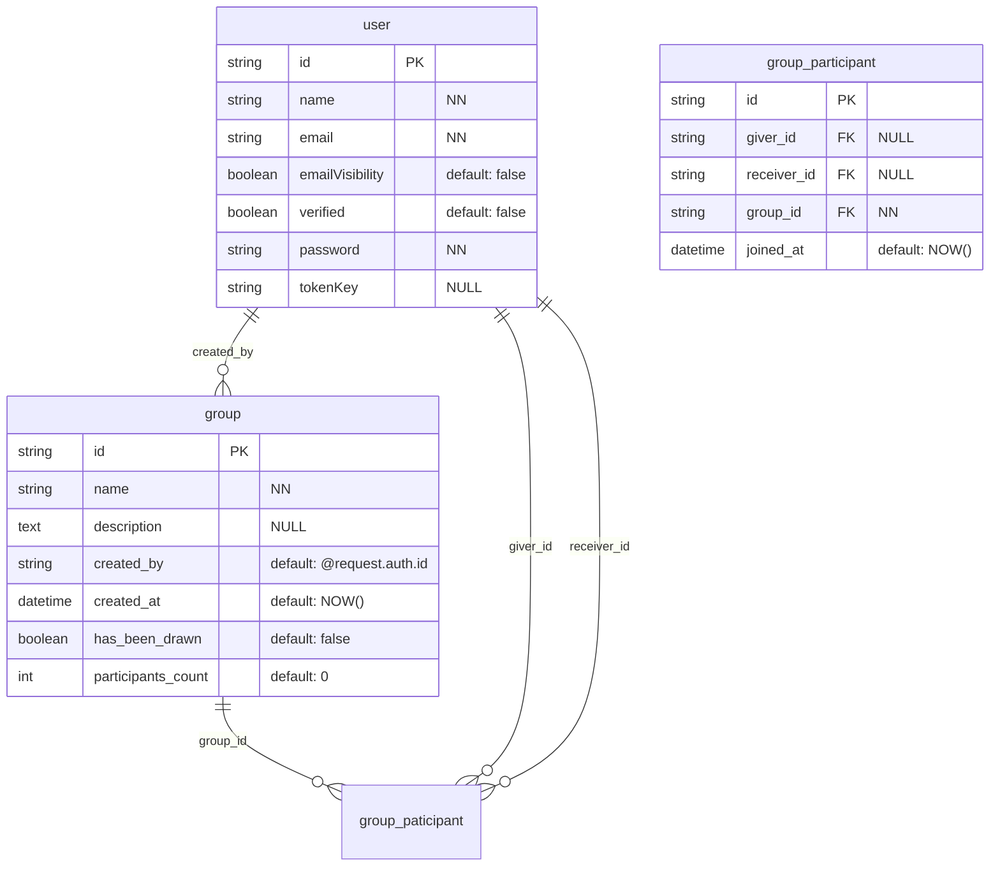
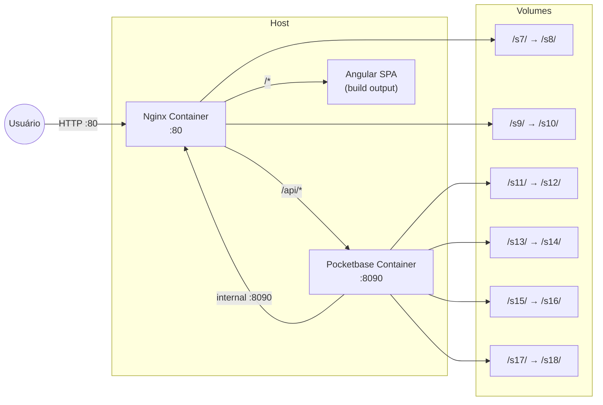

## 🛠️ Software Design Document (SDD) - Seção de Infraestrutura Adicionada

# 🛠️ Software Design Document (SDD)

**Projeto:** Com Quem Será (Amigo Secreto)
**Versão:** 1.0.0  
**Status:** 🟡 Em Desenvolvimento (Implementando Infraestrutura).

## 🤖 1. Orquestração e Contexto de IA (MCP)
> Configuração dos servidores Model Context Protocol para a IDE Agêntica.

* **Figma/Stitch MCP:** `N/A - Projeto sem design prévio no Figma (será feito diretamente com Tailwind).`
* **Pocketbase MCP:** Contexto do banco de dados local ou pocketbase.io (coleções: `users`, `group`, `group_participant`).
* **GitHub MCP:** Leitura das Issues do Kanban para orientar a implementação (Spec-Driven).

## 📦 2. Stack Tecnológica e Bibliotecas
> Definição estrita das tecnologias permitidas (package.json). Nenhuma dependência externa deve ser instalada sem refletir aqui.

* **Core:** Angular 19 (Standalone / Signals).
* **BaaS & Auth:** Pocketbase SDK (`npm install pocketbase`).
* **Estilização & UI:** Tailwind CSS (com plugin forms), Lucide Angular (Ícones).
* **Regra de Estilização:** Todo componente deve usar **exclusivamente** classes utilitárias Tailwind no template HTML. **Nenhum componente pode possuir arquivo CSS próprio** (`styleUrl` / `styleUrls`). Estilos globais e customizações devem ser centralizados em `src/styles.css`.
* **Utilitários:** RxJS (já incluso no Angular), `date-fns` (para manipulação de datas, opcional).
* **HTTP:** Pocketbase SDK (wrapper sobre fetch).
* **Infraestrutura:** Docker, Docker Compose, Nginx (servidor web e proxy reverso).

## 🗄️ 3. Arquitetura de Dados

### 📖 3.1. Glossário Técnico (Mapeamento)
| Termo PRD (PT-BR) | Entidade Técnica (EN) | Atributos Principais |
| :--- | :--- | :--- |
| Usuário | `user` (coleção nativa Pocketbase) | `id`, `name`, `email`, `verified`, `emailVisibility` |
| Grupo | `group` | `id`, `name`, `description`, `created_by` (FK user.id), `created_at`, `has_been_drawn` |
| Participante | `group_participant` | `id`, `group_id` (FK), `giver_id` (FK user.id, NULL antes sorteio), `receiver_id` (FK user.id, NULL antes sorteio), `joined_at` |
| Sorteio (implícito) | Atualização em massa dos `giver_id` e `receiver_id` na tabela `group_participant` | - |

### 📊 3.2. Diagrama ER (Mermaid)



## 📑 4. Contratos Globais (Interfaces & Types)
> Tipagem TypeScript baseada no banco de dados Pocketbase.

```typescript
// src/app/core/models/user.model.ts
export interface User {
  id: string;
  name: string;
  email: string;
  emailVisibility: boolean;
  verified: boolean;
  created: string;   // ISO date
  updated: string;   // ISO date
}

// DTO para criação/edição de usuário (registro)
export interface CreateUserDTO {
  name: string;
  email: string;
  emailVisibility?: boolean;
  password: string;
  passwordConfirm: string;
}

// DTO para login
export interface LoginDTO {
  email: string;
  password: string;
}

// src/app/core/models/group.model.ts
export interface Group {
  id: string;
  name: string;
  description?: string;
  created_by: string;   // user.id
  created_at: string;   // ISO date
  has_been_drawn: boolean;
  participants_count: number;
  expand?: {
    created_by?: User;
    participants_via_group_id?: GroupParticipant[];
  };
}

export type CreateGroupDTO = Omit<Group, 'id' | 'created_at' | 'has_been_drawn'>;

// src/app/core/models/group-participant.model.ts
export interface GroupParticipant {
  id: string;
  giver_id: string | null;      // quem presenteia (preenchido após sorteio)
  receiver_id: string | null;   // quem recebe (preenchido após sorteio)
  group_id: string;
  joined_at: string;            // ISO date
  expand?: {
    giver_id?: User;
    receiver_id?: User;
    group_id?: Group;
  };
}

export type JoinGroupDTO = Omit<GroupParticipant, 'id' | 'joined_at' | 'giver_id' | 'receiver_id'>;

// DTO para atualização de perfil
export interface UpdateProfileDTO {
  name?: string;
  password?: string;
  passwordConfirm?: string;
  oldPassword?: string; // Necessário para troca de senha no Pocketbase
}

// Estado global da aplicação (gerenciado com RxJS)
export interface AppState {
  currentUser: User | null;
  currentGroup: Group | null;
  currentParticipant: GroupParticipant | null;
  groupParticipants: GroupParticipant[];
  isLoading: boolean;
  error: string | null;
}
```

## 🏗️ 5. Scaffolding Macro (Arquitetura Frontend)

### 📂 5.1. Estrutura de Pastas (Monorepo)
```
projeto/
├── apps/
│   ├── web/                     # Aplicação Angular (antigo frontend/)
│   │   ├── src/
│   │   │   ├── app/
│   │   │   │   ├── core/
│   │   │   │   ├── features/
│   │   │   │   └── shared/
│   │   ├── Dockerfile
│   │   ├── nginx.conf
│   │   └── angular.json
│   └── api/                     # Futura API / Backend
├── server/                     # Volumes do Nginx (logs e configuração)
│   ├── logs/
│   └── conf.d/
├── db/                         # Volumes do Pocketbase (dados, logs, uploads)
│   ├── pb_data/
│   ├── pb_public/
│   ├── pb_hooks/
│   └── pb_migrations/
├── package.json                # Maestro do Monorepo (NPM Workspaces)
├── docker-compose.yml
└── .env
```

### 🚦 5.2. Mapa de Rotas e Páginas (Features)
| Rota | Page Component | Functional Guard |
| :--- | :--- | :--- |
| `/` | Redireciona para `/my-groups` | `authGuard` |
| `/login` | `features/auth/login/login.page.ts` | Público (redireciona se logado) |
| `/register` | `features/auth/register/register.page.ts` | Público |
| `/my-groups` | `features/my-groups/my-groups.page.ts` | `authGuard` |
| `/create` | `features/create-group/create-group.page.ts` | `authGuard` |
| `/join` | `features/join-group/join-group.page.ts` (query param `?code=xxx`) | `authGuard` |
| `/group/:groupId` | `features/group-dashboard/group-dashboard.page.ts` | `authGuard`, `groupExistsGuard` |
| `/group/:groupId/reveal` | `features/reveal/reveal.page.ts` | `authGuard`, `groupExistsGuard`, `drawAvailableGuard` |
| `/group/:groupId/admin` | `features/admin/admin-dashboard.page.ts` | `authGuard`, `groupExistsGuard`, `isOrganizerGuard` |
| `/profile` | `features/profile/profile.page.ts` | `authGuard` |

### 🧠 5.3. Core Services (Singleton)
| Service | Arquivo | Responsabilidade Macro |
| :--- | :--- | :--- |
| `AuthService` | `core/services/auth.service.ts` | Gerenciar sessão Pocketbase, login, logout, registro, editar perfil (nome/senha), expor `currentUser$` (BehaviorSubject). |
| `GroupService` | `core/services/group.service.ts` | CRUD de grupos, buscar grupo por ID, listar grupos do usuário (via `group_participant`), estado do grupo atual. |
| `ParticipantService` | `core/services/participant.service.ts` | CRUD em `group_participant`: entrar no grupo (`giver_id`/`receiver_id` = null), sair do grupo, listar participantes de um grupo. |
| `DrawService` | `core/services/draw.service.ts` | Lógica do sorteio: algoritmo de Fisher-Yates que gera um ciclo válido (sem auto-sorteio) e atualiza em lote os `giver_id`/`receiver_id`. Verifica se o sorteio já foi realizado. |
| `StateService` | `core/services/state.service.ts` | Gerenciamento global de estado reativo (grupo atual, participantes, loading, erros) usando RxJS Subjects e combinação com os outros services. |

## 🛡️ 6. Segurança (Pocketbase Collection Rules)
> Regras de acesso configuradas diretamente no Pocketbase via UI ou API.

| Coleção | Regra de Acesso (Pocketbase Rule) | Explicação |
| :--- | :--- | :--- |
| `users` | `@request.auth.id = id` (para update/delete/view detalhado) <br> `@request.auth.id != ""` (para listagem básica) | Usuários só podem ver/editar seus próprios dados. |
| `group` | `create`: `@request.auth.id != ""` <br> `view`: `@request.auth.id != ""` <br> `update/delete`: `created_by = @request.auth.id` | Qualquer usuário logado pode criar/ver grupos. Apenas o criador pode editar/deletar. |
| `group_participant` | `create`: `@request.auth.id != ""` e o grupo não pode ter `has_been_drawn = true` <br> `view`: `@request.auth.id = giver_id OR @request.auth.id = receiver_id OR group_id.created_by = @request.auth.id` <br> `update`: apenas o sistema (via sorteio) ou organizador para remover participantes (antes do sorteio) <br> `delete`: apenas o próprio participante ou organizador (antes do sorteio) | Participantes veem apenas seus próprios pares ou organizador vê tudo. Sorteio é executado por código backend confiável (ou API com regra especial). |

### Regra adicional para o sorteio (API custom ou endpoint):
- O organizador deve executar o sorteio via um **endpoint de API customizado** no Pocketbase (ou uma função que verifica permissões) que:
  1. Verifica se o usuário logado é o `created_by` do grupo.
  2. Verifica se o grupo ainda não foi sorteado (`has_been_drawn = false`).
  3. Verifica se o grupo tem pelo menos 3 participantes.
  4. Executa o algoritmo de sorteio.
  5. Atualiza em lote todos os `group_participant` com seus respectivos `giver_id`/`receiver_id`.
  6. Marca `group.has_been_drawn = true`.
  7. Retorna sucesso ou erro.

## 🐳 7. Infraestrutura e Deploy

### 📦 7.1. Arquitetura de Containers



### 📄 7.3. Nginx Configuration (server/nginx.conf)

```nginx
server {
    listen 80;
    server_name localhost;
    root /usr/share/nginx/html;
    index index.html;

    # Gzip compression
    gzip on;
    gzip_types text/plain text/css application/json application/javascript text/xml application/xml application/xml+rss text/javascript;

    # Proxy para API do Pocketbase
    location /api/ {
        proxy_pass http://pocketbase:8090/api/;
        proxy_http_version 1.1;
        proxy_set_header Upgrade $http_upgrade;
        proxy_set_header Connection 'upgrade';
        proxy_set_header Host $host;
        proxy_set_header X-Real-IP $remote_addr;
        proxy_set_header X-Forwarded-For $proxy_add_x_forwarded_for;
        proxy_set_header X-Forwarded-Proto $scheme;
        proxy_cache_bypass $http_upgrade;
        
        # Timeouts para operações longas (sorteio)
        proxy_connect_timeout 60s;
        proxy_send_timeout 60s;
        proxy_read_timeout 60s;
    }

    # Proxy para admin UI do Pocketbase (opcional, apenas desenvolvimento)
    location /_/ {
        proxy_pass http://pocketbase:8090/_/;
        proxy_http_version 1.1;
        proxy_set_header Host $host;
        proxy_set_header X-Real-IP $remote_addr;
    }

    # Arquivos estáticos com cache
    location ~* \.(js|css|png|jpg|jpeg|gif|ico|svg|woff|woff2)$ {
        expires 1y;
        add_header Cache-Control "public, immutable";
    }

    # SPA fallback (todas as rotas não API vão para index.html)
    location / {
        try_files $uri $uri/ /index.html;
    }

    # Logs
    access_log /var/log/nginx/access.log;
    error_log /var/log/nginx/error.log;
}
```

### 🏗️ 7.4. Frontend Dockerfile (apps/web/Dockerfile - Multi-stage)

```dockerfile
# Stage 1: Build Angular
FROM node:20-alpine AS builder
WORKDIR /app
COPY package*.json ./
RUN npm ci
COPY . .
RUN npm run build -- --configuration production

# Stage 2: Nginx com os arquivos buildados
FROM nginx:alpine
COPY --from=builder /app/dist/frontend/browser /usr/share/nginx/html
COPY nginx.conf /etc/nginx/conf.d/default.conf
EXPOSE 80
CMD ["nginx", "-g", "daemon off;"]
```

### 📁 7.5. Estrutura de Arquivos de Infraestrutura

```
projeto/
├── .env                        # Variáveis de ambiente
├── docker-compose.yml
├── package.json                # Workspaces config
├── apps/
│   ├── web/
│   │   ├── Dockerfile
│   │   ├── nginx.conf
│   │   └── ... (código Angular)
│   └── api/
├── server/                     # Persistentes do Nginx
│   ├── logs/
│   └── nginx.conf
└── db/                         # Persistentes do Pocketbase
    ├── pb_data/
    ├── pb_public/
    ├── pb_hooks/
    └── pb_migrations/
```

### 🔧 7.6. Comandos de Operação

| Comando | Descrição |
| :--- | :--- |
| `docker-compose up -d` | Iniciar todos os containers em background |
| `docker-compose down` | Parar e remover containers |
| `docker-compose logs -f nginx` | Ver logs do Nginx em tempo real |
| `docker-compose logs -f pocketbase` | Ver logs do Pocketbase em tempo real |
| `docker-compose exec pocketbase ls -la /pb/pb_data` | Inspecionar volume de dados |
| `docker-compose restart nginx` | Reiniciar apenas o Nginx |

### 🌐 7.7. URLs de Acesso

| Serviço | URL (Host) | Container Interno | Acessível ao Host? |
| :--- | :--- | :--- | :--- |
| Aplicação Angular | `http://localhost` | Nginx :80 | ✅ Sim |
| API Pocketbase | `http://localhost/api/*` | Pocketbase :8090 | ✅ Sim (via proxy) |
| Admin UI Pocketbase | `http://localhost/_/` | Pocketbase :8090 | ✅ Sim (via proxy, opcional) |
| Pocketbase Direto | `http://localhost:8090` | - | ❌ Não (porta não exposta) |

### 🔒 7.8. Segurança da Infraestrutura

- **Isolamento de Rede:** Containers se comunicam apenas via rede interna `amigo-secreto-network`.
- **Portas Expostas:** Apenas a porta 80 do Nginx está acessível ao host.
- **Volumes Persistentes:** Dados do Pocketbase (`pb_data`) persistem mesmo após `docker-compose down`.
- **Logs Rotativos:** Configurar logrotate no host para `./server/logs/*.log` (opcional).
- **Variáveis Sensíveis:** Usar arquivo `.env` (não versionado) para credenciais do superuser do Pocketbase.

### 📦 7.9. Build e Deploy (Pipeline Manual)

```bash
# 1. Configurar variáveis de ambiente
cp example.env .env

# 2. Build da aplicação Angular (via Workspace)
npm run build -w apps/web -- --configuration production

# 3. (Opcional) Copiar configuração custom do Nginx
cp apps/web/nginx.conf server/nginx.conf

# 4. Subir os containers
docker-compose up -d --build

# 5. Verificar status
docker-compose ps

# 6. Acompanhar logs iniciais
## 🔐 8. Variáveis de Ambiente

O projeto utiliza um arquivo `.env` para gerenciar configurações e segredos. Um modelo pode ser encontrado em `example.env`.

| Variável | Descrição | Valor Padrão/Exemplo |
| :--- | :--- | :--- |
| `PB_SUPERUSER_EMAIL` | E-mail para login no painel administrativo do PocketBase. | `admin@amigosecreto.com` |
| `PB_SUPERUSER_PASSWORD` | Senha para login no painel administrativo do PocketBase. | `senhaSegura123` |
| `APP_ENV` | Define o ambiente da aplicação (`dev` ou `prod`). Se for `dev`, o script de seed é executado para limpar e popular o banco com dados de teste. | `dev` |

### ⚠️ Importante
- O arquivo `.env` **não deve ser versionado** (já incluído no `.gitignore`).
- Em produção, certifique-se de usar senhas fortes.

## Biblioteca de Componentes Escolhida

A equipe optou por utilizar o DaisyUI.

A decisão foi baseada na velocidade de desenvolvimento, já que a biblioteca fornece componentes prontos integrados ao Tailwind, permitindo a criação de interfaces modernas com menos esforço e configuração.
